###### PT

# Observatório de Dados da Pró-Reitoria de Administração e Finanças da Universidade de Pernambuco (UPE)

JOHNNY CLEITON (aluno residente)  
JOSS TIMOTEO (aluno residente)   
RAPHAEL FEITOSA (aluno servidor) 

Este projeto é resultado do Trabalho de Conclusão de Curso desenvolvido na **Residência em Ciência de Dados e Analytics** da Universidade de Pernambuco (UPE). A iniciativa surgiu por meio da colaboração entre residentes da área de tecnologia e servidores da instituição, com o objetivo de cocriar um observatório digital fundamentado em dados disponibilizados pelos setores da universidade. Neste trabalho, o foco está na Pró-Reitoria de Administração e Finanças (PROADMI), setor responsável pela gestão e acompanhamento da movimentação contratual dos diversos campi da UPE.

<div align="center">
  
| 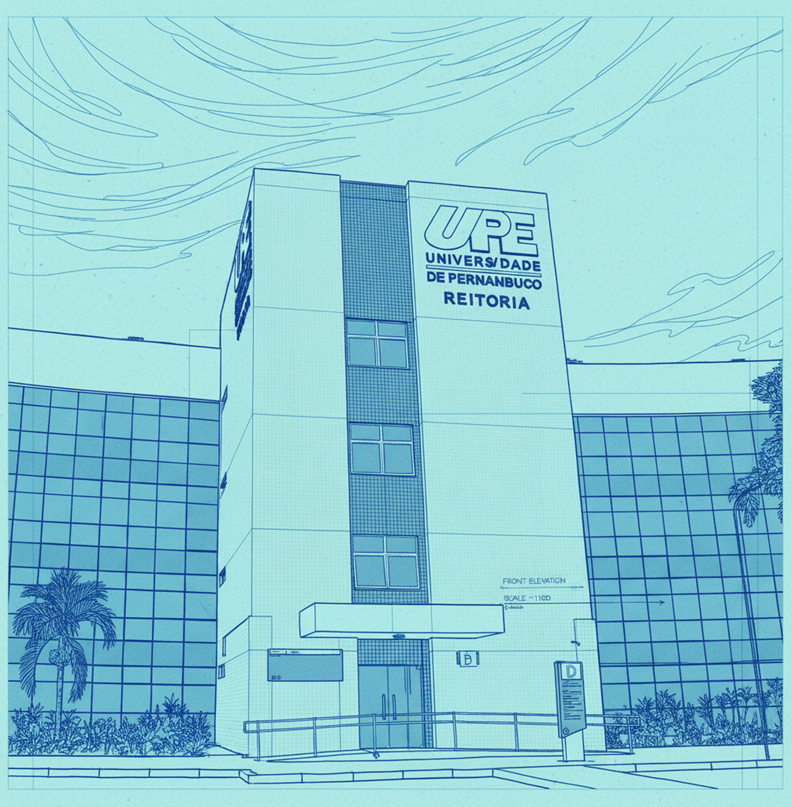 |
|:--:|

</div>


## MOTIVAÇÃO
Centralizar o acompanhamento dos contratos da UPE por meio de um dashboard interativo.

> [!TIP]
> Caso queira executar a aplicação diretamente em sua máquina, pule para a seção de [Como Executar o Projeto](#-como-executar-o-projeto).


## BACKGROUND

#### O Setor e o Problema
A PROADMI desempenha um papel decisivo na governança orçamentária e operacional da UPE. Dentro de seu escopo, o setor de Contratos gerencia um volume expressivo de acordos, termos aditivos e prazos de vigência. O grande desafio residia na sintetização dessas informações, o que dificultava análises preditivas de despesas, o controle visual de vencimentos iminentes e a distribuição equilibrada da carga administrativa.

#### Base de Dados
A aplicação é alimentada pela **PGC (Planilha de Gerenciamento de Contratos)**, uma base de dados idealizada, estruturada e mantida por [Raphael Feitosa](https://www.linkedin.com/in/raphael-feitosa-49840a258/) junto à gerência do setor. A planilha tem o propósito de registrar, fiscalizar e atualizar o ciclo de vida de todos os contratos (ativos ou inativos) e conta atualmente com cerca de 70 colunas, englobando variáveis críticas como número do processo licitatório, objeto contratado, valores globais/mensais, vigência cronológica, dados dos fornecedores e fiscais responsáveis.


## PROCESSO DE CONSTRUÇÃO E TECNOLOGIAS

#### Tratamento de Dados

Todo o processo de Extração, Transformação e Carga (ETL) foi desenvolvido utilizando o [**Apache Hop**](https://hop.apache.org/), garantindo a padronização, limpeza e integridade dos dados extraídos da planilha PGC antes de sua renderização.
  
<div align="center">
  
| 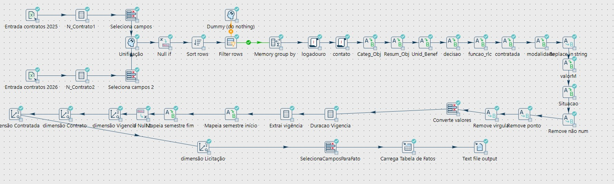 |
|:--:|
| *Pipeline de ETL construído no Apache Hop* |

</div>

#### Implementação e Interface

O dashboard foi codificado inteiramente em **Python** com apoio de **CSS** na estilização. O framework utilizado para a arquitetura web da aplicação foi o [**Streamlit**](https://streamlit.io/), e as bibliotecas **Pandas** e **Plotly Express** complementaram para a manipulação analítica e geração de gráficos interativos.

<div align="center">
  
|  |
|:--:|

</div>


<p align="center">
  ✦ ✦ ✦
</p>


## ANÁLISE DOS GRÁFICOS

Esta é a seção central do observatório. Além de indicadores básicos de performance (*KPIs - Key Performance Indicators*), o dashboard está segmentado em 3 grandes blocos funcionais: Administrativo, Financeiro e Estratégico. No total são **14 gráficos** planejados para responder a diferentes níveis de perguntas de negócio da PROADMI.

<div align="center">
  
| 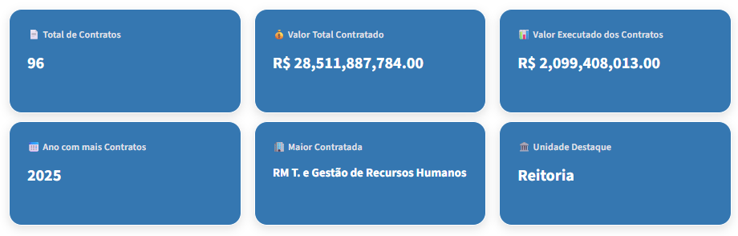 |
|:--:|
| *Key Performance Indicators* |

</div>


#### 📈 Bloco 1: ADMINISTRATIVO
Focado na análise detalhada da quantidade, categorização, vigência e base legal dos contratos.

1. **📅 Quantidade de Contratos por Ano - Evolução Histórica Total**
   * **Descrição:** mostra o crescimento ou redução na quantidade total de contratos firmados ao longo dos anos, respondendo como o volume de novos contratos da instituição está evoluindo a longo prazo e se há alguma tendência histórica de alta ou queda.
   * **Tipo de Gráfico:** gráfico de área.
     
<div align="center">
  
| 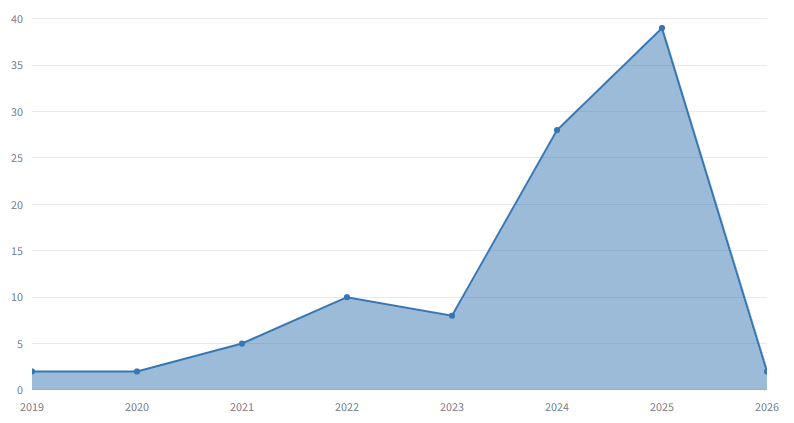 |
|:--:|
| *Evolução Histórica Total* |

</div>
 


2. **📅 Quantidade de Contratos por Ano - Comparativo 2025 x 2026**
   * **Descrição:** compara lado a lado a quantidade de contratos de dois anos específicos selecionados pelo usuário, respondendo qual dos dois períodos comparados foi mais produtivo em termos de novas contratações e qual a diferença exata entre eles.
   * **Tipo de Gráfico:** gráfico de barras verticais.
     
<div align="center">
  
| 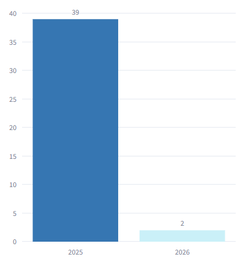 |
|:--:|
| *Comparativo 2025 x 2026* |

</div>


3. **🏷️ Contratos por Categoria do Objeto - Distribuição Hierárquica de Categorias**
   * **Descrição:** representa visualmente o peso de cada categoria de contrato no total acumulado através de blocos proporcionais, respondendo instantaneamente quais categorias de objetos (ex: serviços, compras) são mais frequentes e dominam o ecossistema de contratos.
   * **Tipo de Gráfico:** treemap (mapa de árvore).
     
<div align="center">
  
| 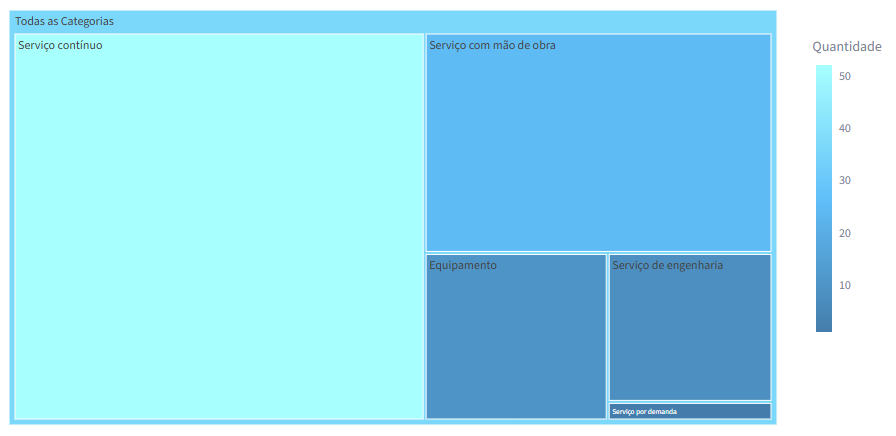 |
|:--:|
| *Distribuição Hierárquica de Categorias*  |

</div>


4. **⚖️ Contratos Vigentes por Classificação da Lei - Proporção de Contratos Ativos**
   * **Descrição:** exibe a divisão percentual dos contratos vigentes entre a Lei antiga (8666/93) e a nova Lei de Licitações (14133/21), respondendo qual é o percentual de adesão e o andamento da transição jurídica para o novo marco regulatório nos contratos ativos.
   * **Tipo de Gráfico:** gráfico de rosca (ou pizza com furo central).
     
<div align="center">
  
| 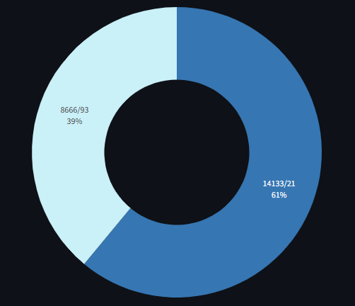 |
|:--:|
| *Proporção de Contratos Ativos* |

</div>


5. **⚖️ Contratos Vigentes por Classificação da Lei - Volume de Contratos Ativos**
   * **Descrição:** apresenta a quantidade absoluta exata de contratos que estão em execução sob o regime de cada lei, respondendo numericamente quantos contratos vigentes ainda estão vinculados à legislação antiga versus a quantidade já licitada pela nova.
   * **Tipo de Gráfico:** gráfico de barras horizontais.
     
<div align="center">
  
| 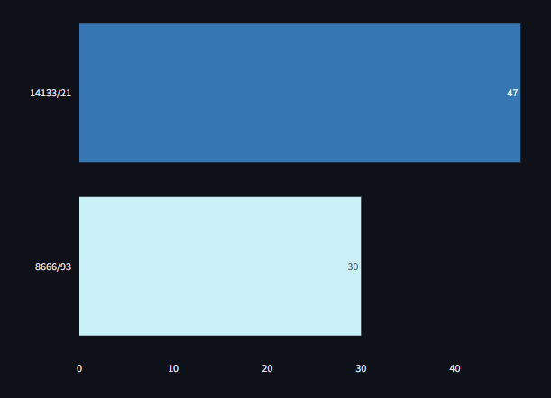 |
|:--:|
| *Volume de Contratos Ativos* |

</div>


6. **⏳ Quantidade de Contratos por Vigência - Contratos por Tipo de Vigência**
   * **Descrição:** mostra a quantidade de contratos vigentes divididos por modalidades de prazo (anos, meses ou dias), respondendo qual o perfil de duração mais comum adotado pela administração nas suas contratações padrão.
   * **Tipo de Gráfico:** gráfico de barras verticais.
     
<div align="center">
  
| 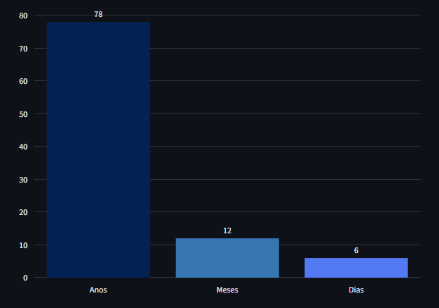 |
|:--:|
| *Contratos por Tipo de Vigência* |

</div>


7. **⏳ Quantidade de Contratos por Vigência - Ranking de Tempos Contratuais (Top 10)**
   * **Descrição:** lista de forma ordenada os 10 prazos de validade (em meses/dias) que mais se repetem nos contratos, respondendo quais são as durações contratuais mais padronizadas e utilizadas de maneira recorrente pelo setor de compras.
   * **Tipo de Gráfico:** gráfico de barras horizontais.
   
<div align="center">
  
| 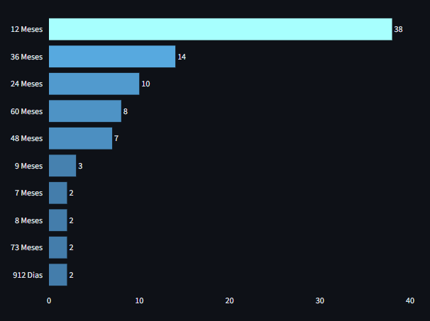 |
|:--:|
| *Ranking de Tempos Contratuais (Top 10)* |

</div>


8. **⏳ Quantidade de Contratos por Vigência - Tipo de Vigência x Categoria do Objeto**
   * **Descrição:** lista de forma ordenada os 10 prazos de validade (em meses/dias) que mais se repetem nos contratos, respondendo como os prazos se comportam dentro de cada categoria (ex: se "Serviços de Engenharia" são majoritariamente contínuos ou determinados).
   * **Tipo de Gráfico:** gráfico de barras empilhadas.
     
<div align="center">
  
| 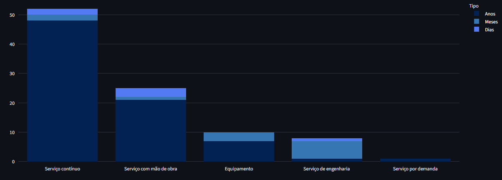 |
|:--:|
| *Tipo de Vigência x Categoria do Objeto* |

</div>


#### 💰 Bloco 2: FINANCEIRO
Destinado ao companhamento do volume de recursos empenhados, liquidações e distribuição por categoria.

9. **🗂️ Comportamento dos Valores Contratados - Soma dos Valores Totais por Ano (Tamanho indica Volume)**
   * **Descrição:** traça a evolução financeira total contratada por ano, usando o tamanho dos pontos para destacar os picos de valores, respondendo em quais anos a instituição assumiu os maiores compromissos financeiros e qual a tendência do orçamento contratado no tempo.
   * **Tipo de Gráfico:** gráfico de linha combinado com dispersão (gráfico de bolhas).
     
<div align="center">
  
| 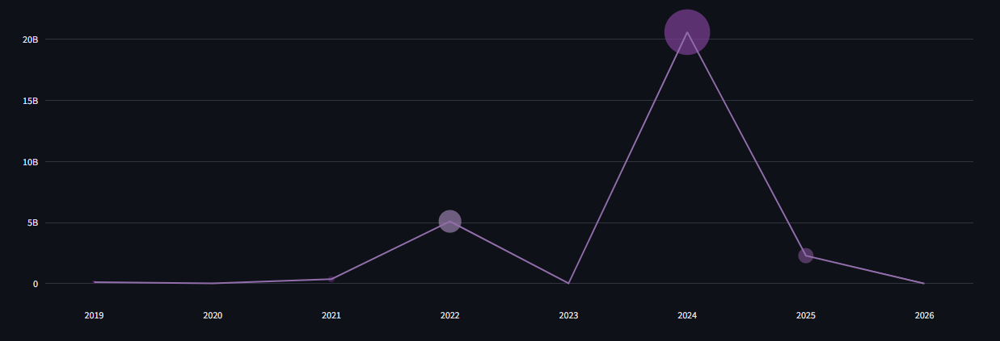 |
|:--:|
| *Soma dos Valores Totais por Ano (Tamanho indica Volume)* |

</div>


10. **📈 Evolução da Execução Financeira - Histórico de Valores Liquidados/Executados por Ano**
    * **Descrição:** apresenta a curva histórica dos valores financeiros que já foram efetivamente liquidados e pagos ano a ano, respondendo se o dinheiro planejado está sendo realmente gasto no ritmo esperado e como anda a eficiência da execução financeira líquida.
    * **Tipo de Gráfico:** gráfico de área suavizada (spline).
     
<div align="center">
  
| 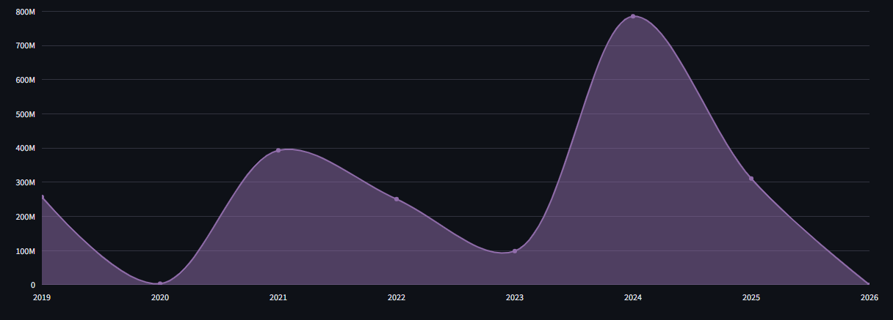 |
|:--:|
| *Histórico de Valores Liquidados/Executados por Ano* |

</div>


11. **🏷️ Investimento por Categoria do Objeto - Top 3 Categorias com Maior Concentração de Recursos Financeiros**
    * **Descrição:** destaca os valores em Reais (R$) consumidos pelas três categorias mais caras da instituição, respondendo de forma direta quais são os três macro-objetos que mais drenam e concentram o orçamento financeiro total da entidade.
    * **Tipo de Gráfico:** gráfico de barras verticais.
      
<div align="center">
  
| 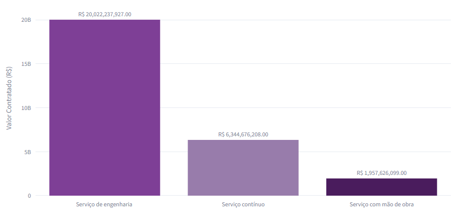 |
|:--:|
| *Top 3 Categorias com Maior Concentração de Recursos Financeiros* |

</div>


#### 🎯 Bloco 3: ESTRATÉGICO
Evolução temporal do comportamento dos contratos e direcionamento de fornecedores.

12. **🎯 Visão Estratégica e Sazonalidade - Contratos Mês a Mês (Início de Vigência)**
    * **Descrição:** distribui a quantidade de assinaturas ou inícios de contratos ao longo dos 12 meses do ano, respondendo se existe um padrão de sazonalidade na administração (ex: se há um acúmulo de contratos iniciando sempre em dezembro ou janeiro).
    * **Tipo de Gráfico:** gráfico de barras verticais.
      
<div align="center">
  
| 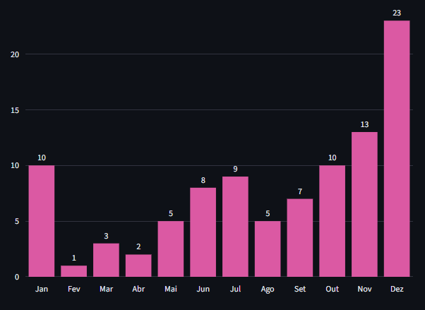 |
|:--:|
| *Contratos Mês a Mês (Início de Vigência)* |

</div>


13. **🎯 Visão Estratégica e Sazonalidade - Top 5 Contratadas**
    * **Descrição:** classifica em um ranking os 5 fornecedores/empresas que possuem o maior número de contratos ativos, respondendo quem são os parceiros comerciais mais frequentes e ajuda a identificar possíveis cenários de dependência de poucos fornecedores.
    * **Tipo de Gráfico:** gráfico de barras horizontais.
      
<div align="center">
  
| 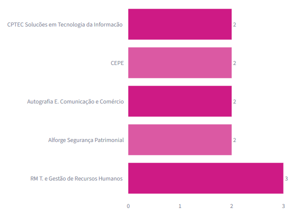 |
|:--:|
| *Top 5 Contratadas* |

</div>


14. **🎯 Visão Estratégica e Sazonalidade - Comportamento Mensal por Categoria**
    * **Descrição:** monitora a variação do início de novos contratos mês a mês, separando cada categoria de objeto por uma linha colorida diferente, respondendo qual o comportamento de demanda de cada setor ao longo do ano, mostrando se compras de equipamentos aumentam em meses que serviços de engenharia caem, por exemplo.
    * **Tipo de Gráfico:** gráfico de linhas múltiplas.
      
<div align="center">
  
| 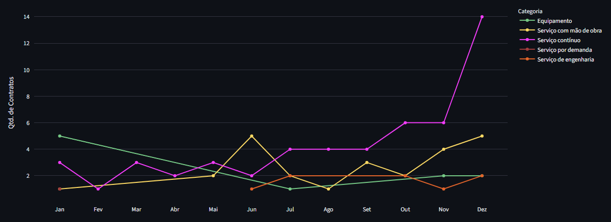 |
|:--:|
| *Comportamento Mensal por Categoria* |

</div>


<p align="center">
  ✦ ✦ ✦
</p>


## Como Executar o Projeto

### Pré-requisitos

Antes de executar o dashboard, certifique-se de que os seguintes softwares estão instalados em sua máquina:

* **Python 3.8 ou superior**
* **Git** ou **GitHub Desktop**
* **Visual Studio Code (VS Code)**

### 1. Obtendo o Projeto

#### Opção A – Clonando com Git

Abra o terminal do sistema ou o terminal integrado do VS Code e execute:

```bash
git clone https://github.com/seu-usuario/dashboard-streamlit-upe.git
cd dashboard-streamlit-upe
```

#### Opção B – Clonando com GitHub Desktop

1. Abra o **GitHub Desktop**.
2. Clique em **File → Clone Repository**.
3. Selecione o repositório desejado ou informe a URL do projeto.
4. Escolha a pasta de destino.
5. Clique em **Clone**.
6. Após a clonagem, clique em **Open in Visual Studio Code** para abrir o projeto.


### 2. Criando o Ambiente de Desenvolvimento (Opcional)

Embora não seja obrigatório, recomenda-se utilizar um ambiente virtual para evitar conflitos entre bibliotecas e versões do Python.

```bash
python -m venv venv
```

Ative o ambiente:

**Windows**

```bash
venv\Scripts\activate
```

**Linux/MacOS**

```bash
source venv/bin/activate
```


### 3. Instalando as Dependências

O dashboard foi desenvolvido utilizando principalmente as bibliotecas **Streamlit**, **Pandas** e **Plotly**.

Instale-as com os comandos:

```bash
pip install streamlit
pip install pandas
pip install plotly
```


### 4. Verificando a Instalação do Streamlit

Para confirmar que o Streamlit foi instalado corretamente, execute:

```bash
streamlit hello
```

Uma página de demonstração será aberta automaticamente em seu navegador.

> [!IMPORTANT]
> Em algumas versões do Python podem ocorrer incompatibilidades com o Streamlit. Caso isso aconteça, recomenda-se utilizar um ambiente virtual com uma versão compatível do Python.


### 5. Estrutura Geral do Dashboard

Ao abrir o código `dashboard.py` no VS Code, você visualizará a seguinte estrutura:

```text
dashboard.py
│
├── Configuração da Aplicação
│   ├── 1. CONFIGURAÇÕES: inicialização da página do Streamlit.
│   ├── 2. ESTILIZAÇÃO: CSS customizado injetado via Markdown para componentes e KPIs.
│   └── 3. CABEÇALHO: elementos visuais de título da aplicação.
│
├── Preparação dos Dados
│   ├── 4. CARREGAMENTO DE DADOS: upload de arquivos e fallback para base local.
│   ├── 5. PROCESSAMENTO DE DADOS: tratamento, conversões de tipos e novas colunas.
│   └── 6. COMPONENTES SIDEBAR: filtros laterais e lógicas de índices de datas.
│
├── Sistema de Filtros
│   └── 7. APLICAÇÃO DOS FILTROS: filtragem dinâmica do DataFrame principal.
│
├── Indicadores e Métricas
│   └── 8. CÁLCULO E EXIBIÇÃO DE KPIS: métricas resumidas apresentadas em cards.
│
├── Visualizações Analíticas
│   ├── 9. SEÇÃO ADMINISTRATIVA: visualizações focadas em eficiência operacional.
│   ├── 10. SEÇÃO FINANCEIRA: visualizações focadas em gastos e execução financeira.
│   └── 11. SEÇÃO ESTRATÉGICA: gráficos de tendências temporais e distribuições gerais.
│
└── Exportação de Dados
    └── 12. APRESENTAÇÃO E DOWNLOAD DA BASE: visualização bruta e exportação CSV.
```


### 6. Executando o Dashboard

Abra o terminal na pasta onde se encontra o arquivo principal do dashboard e execute:

```bash
streamlit run dashboard.py --server.port 8888
```

Após a execução, o Streamlit abrirá automaticamente uma nova aba no navegador exibindo o dashboard.

Também é possível acessar manualmente através do endereço:

```text
http://localhost:8888
```


### 7. Encerrando a Aplicação

Para interromper a execução do dashboard, volte ao terminal e pressione:

```bash
Ctrl + C
```

---
#### 📄 Informações Adicionais

* Para uma visão mais aprofundada, acesse o **artigo científico completo** desenvolvido durante a residência. Além de detalhar a metodologia, o referencial teórico e os resultados obtidos com o dashboard, o documento explora etapas avançadas não documentadas neste repositório, como a **aplicação de algoritmos de aprendizado de máquina (Machine Learning)** aos dados. [Clique aqui para ler](https://github.com/johnnycleiton07/dashboard-streamlit-upe/tree/main/artigo).


#### ⚖️ Direitos e Licença

* **Propriedade Institucional:** todos os direitos deste projeto são reservados à **Universidade de Pernambuco (UPE)**.
* **Transparência e Domínio Público:** a base de dados utilizada é de caráter e **domínio público**, estando em total conformidade com a Lei de Acesso à Informação (LAI). Os dados brutos originais podem ser consultados oficialmente através do Portal da Transparência da instituição.
* **Finalidade Deste Repositório:** este ambiente serve primariamente como portfólio técnico e documentação acadêmica. O código aqui disponibilizado cumpre o papel de registrar o aprendizado prático da equipe e servir como material pedagógico de estudo para futuras soluções de Business Intelligence dentro do ecossistema universitário.
